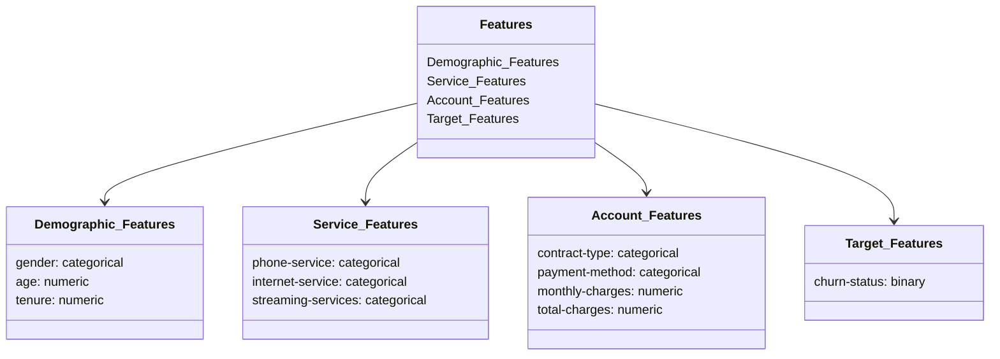

# MLOps Pipeline Project

## Overview

This MLOps pipeline for customer churn prediction aims to provide an automated, scalable, and robust system for predicting customer churn and implementing strategies to mitigate it. By leveraging machine learning, businesses can prioritize customer retention efforts and optimize marketing strategies.

## Key Stakeholders

**Business Leaders**

**Marketing Team**

**Customer Success Managers**

**Data Science Team**

## Dataset

The project uses the Telco Customer Churn dataset, which contains customer details and their churn status. This dataset is used to build a predictive model to identify customers likely to churn.

